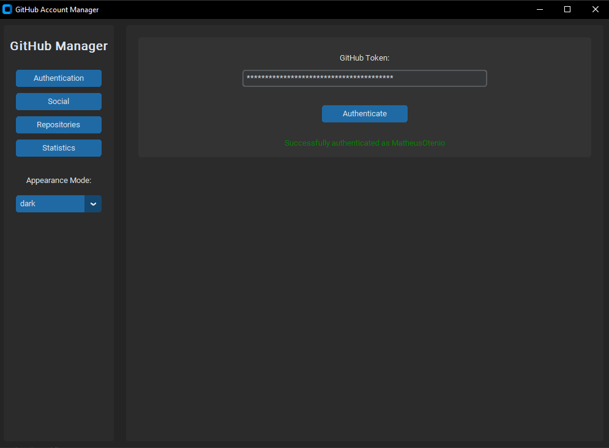
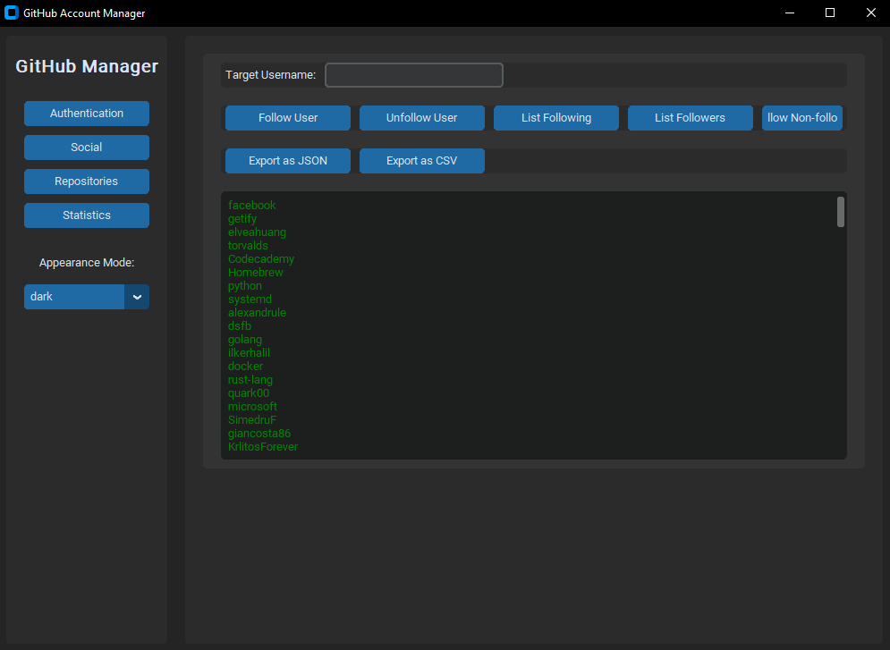
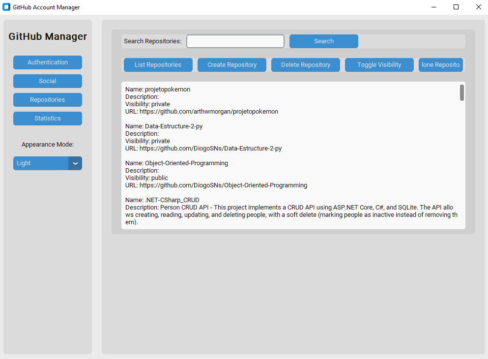

# GitHub Account Manager


Uma aplicação desktop desenvolvida em Python com CustomTkinter para gerenciar contas GitHub através da API REST do GitHub.

## 📋 Índice

- [Funcionalidades](#-funcionalidades)
- [Capturas de Tela](#-capturas-de-tela)
- [Instalação](#-instalação)
- [Requisitos de Sistema](#-requisitos-de-sistema)
- [Como Utilizar](#-como-utilizar)
- [Token GitHub](#-token-github)
- [Estrutura do Projeto](#-estrutura-do-projeto)
- [Desenvolvimento](#-desenvolvimento)
- [Contribuição](#-contribuição)
- [Aviso de Segurança](#-aviso-de-segurança)

## 🚀 Funcionalidades

### 🔐 Autenticação

- Autenticação segura com Token de Acesso Pessoal (PAT) do GitHub
- Mascaramento do token para segurança adicional

### 🎨 Interface de Usuário

- Interface gráfica limpa e intuitiva baseada em CustomTkinter
- Modo claro e escuro
- Navegação por abas para diferentes funcionalidades

### 👥 Social

- Seguir/Deixar de seguir usuários
- Listar seguidores e seguindo
- Deixar de seguir automaticamente usuários que não retribuem o follow
- Exportar dados sociais em formatos JSON e CSV

### 📁 Repositórios

- Listar repositórios do usuário
- Buscar repositórios específicos
- Criar novos repositórios
- Excluir repositórios existentes
- Alternar visibilidade entre público e privado

### 📊 Estatísticas

- Visualização gráfica da distribuição de repositórios públicos/privados
- Contagem total de repositórios

## 📸 Capturas de Tela


_Tela de autenticação com token do GitHub_


_Gerenciamento de seguidores e usuários seguidos_


_Visualização e gerenciamento de repositórios_

## 💻 Instalação

### Opção 1: Download da Versão Compilada

1. Faça o download do arquivo ZIP mais recente na página de Releases do GitHub
2. Extraia o arquivo ZIP para o local desejado
3. Execute o arquivo GitPy.exe

### Opção 2: Instalação via Código-Fonte

1. Clone o repositório:

   ```bash
   git clone https://github.com/seu-usuario/github-account-manager.git
   cd github-account-manager
   ```

2. Instale as dependências:

   ```bash
   pip install -r requirements.txt
   ```

3. Execute a aplicação:
   ```bash
   python github_manager_app.py
   ```

## 🔧 Requisitos de Sistema

- Sistema operacional Windows
- Microsoft Visual C++ Redistributable (geralmente pré-instalado)
- Conexão ativa com a internet para acesso à API do GitHub
- Permissões suficientes para executar aplicações

## 📝 Como Utilizar

1. Inicie a aplicação
2. Na aba de autenticação, insira seu token de acesso pessoal do GitHub
3. Clique em "Autenticar"
4. Navegue pelas abas (Social, Repositórios, Estatísticas) para utilizar as funcionalidades

## 🔑 Token GitHub

Para usar esta aplicação, você precisará de um Token de Acesso Pessoal (PAT) do GitHub:

1. Acesse [GitHub Settings > Developer settings > Personal access tokens](https://github.com/settings/tokens)
2. Clique em "Generate new token"
3. Selecione os escopos necessários (recomendado: `repo`, `user`)
4. Gere o token e copie-o
5. Use o token para autenticar-se na aplicação

**Observação**: O token nunca é armazenado permanentemente pela aplicação.

## 📂 Estrutura do Projeto

```
github-account-manager/
├── github_manager_app.py  # Aplicação principal e interface gráfica
├── github_api.py          # Integração com a API do GitHub
├── requirements.txt       # Dependências do projeto
├── create_shortcut.bat    # Script para criar atalho no desktop
├── img/                   # Pasta com imagens da aplicação
└── .gitignore            # Arquivos ignorados pelo git
```

## 🛠️ Desenvolvimento

### Compilando o Executável

Para criar um executável standalone:

```bash
pyinstaller --noconfirm --onefile --windowed github_manager_app.py
```

Para criar um atalho no desktop após a compilação:

```bash
create_shortcut.bat
```

### Principais Dependências

- `customtkinter`: Framework para interface gráfica moderna
- `PyGithub`: Biblioteca para interação com a API do GitHub
- `matplotlib`: Geração de gráficos estatísticos
- `pandas`: Manipulação e exportação de dados

## 👥 Contribuição

Contribuições são bem-vindas! Sinta-se à vontade para abrir issues ou enviar pull requests com melhorias.

1. Faça um fork do projeto
2. Crie uma branch para sua feature (`git checkout -b feature/nova-funcionalidade`)
3. Faça commit das suas alterações (`git commit -m 'Adiciona nova funcionalidade'`)
4. Faça push para a branch (`git push origin feature/nova-funcionalidade`)
5. Abra um Pull Request

## 🔒 Aviso de Segurança

Nunca compartilhe seu Token de Acesso Pessoal. A aplicação armazena o token apenas na memória durante a execução e não o salva em nenhum arquivo local.
